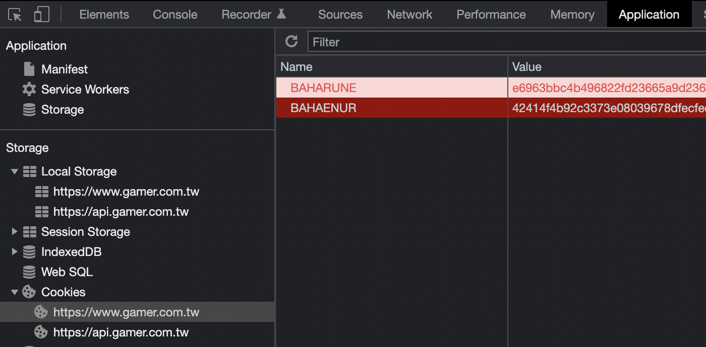

# 以 Cookie 登入

- Module Name: `cookie_login`

## 參數

必要參數： `username`, `BAHARUNE`, `BAHAENUR`

### 使用方法

以 `cookie_login` 取代 `login` 模組，並加上 `BAHARUNE` 及 `BAHAENUR` 參數。

*`BAHARUNE` 及 `BAHAENUR` 參數可以在瀏覽器的開發人員工具中找到。*

> *PS: 圖中的值是我亂打的，不要浪費時間去試*
